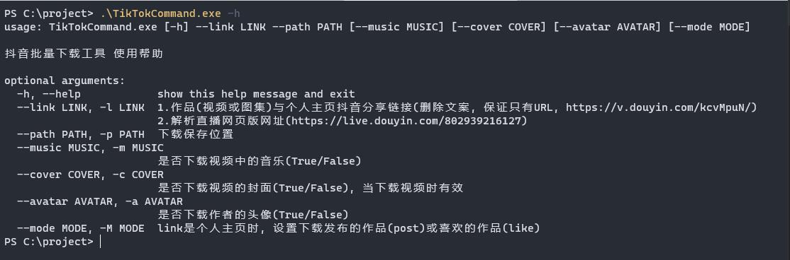
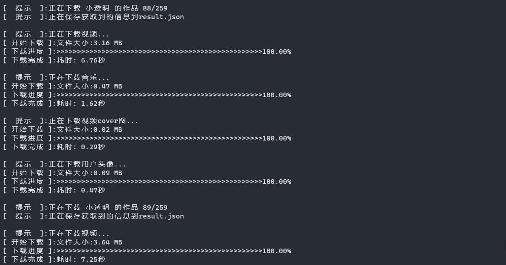
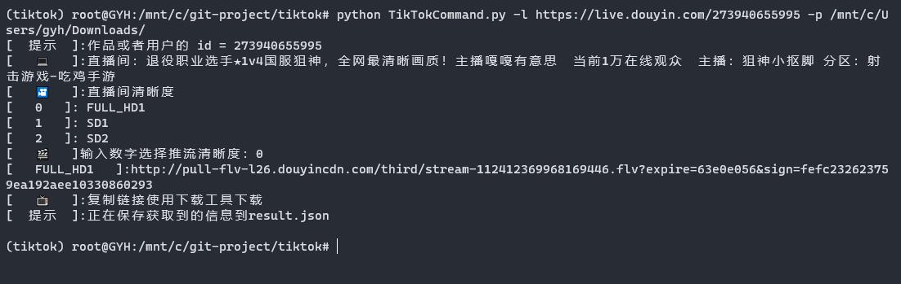
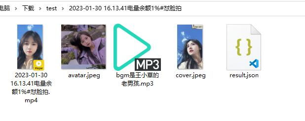

💾 本程序中大量使用了ChatGPT生成的代码，如有bug，请在issue中提出。

👉 想要了解如何使用ChatGPT写程序，可以加群交流。

# 抖音批量下载工具功能介绍

💁 支持个人主页链接、作品分享链接、抖音直播Web链接、合集链接、音乐(原声)集合链接

🔽 支持单个作品下载、主页作品下载、主页喜欢下载、直播解析、单个合集下载、主页所有合集下载、音乐(原声)集合下载

📹 下载视频、视频封面、音乐、头像

💦 去水印下载

⏭️ 自动跳过已下载

👉 支持指定下载作品数量

🔗 多线程下载、多链接下载

📈 增量更新与数据持久化到数据库, 保存每条作品信息到数据库, 并根据数据库是否存在来增量请求下载


# 申明

本项目只作为学习用途, 切勿他用.
有任何问题可以进群交流。


# 使用截图







# 使用方法

- 支持的地址格式, 形如

```
抖音链接:
1. 作品(视频或图集)、直播、合集、音乐集合、个人主页    https://v.douyin.com/BugmVVD/    
抖音网页版浏览器URL:
2. 单个视频             https://www.douyin.com/video/6915675899241450760
3. 单个图集             https://www.douyin.com/note/7014363562642623777
4. 用户主页             https://www.douyin.com/user/MS4wLjABAAAA06y3Ctu8QmuefqvUSU7vr0c_ZQnCqB0eaglgkelLTek
5. 单个合集             https://www.douyin.com/collection/7208829743762769975
6. 音乐(原声)下的视频     https://www.douyin.com/music/7149936801028131598
7. 直播                https://live.douyin.com/759547612580                     
```

# 抖音批量下载工具

批量下载有两种方式运行, 配置文件和命令行

默认使用配置文件方式，在配置文件`config.example.yml`中修改内容后，将文件另存为`config.yml`。

### 安装依赖

windows用户下载 Release文件夹 中的 [DouYinCommand.exe]文件运行
windows用户本地有`python3.9`环境, 也可按照linux与mac用户的方式运行

linux与mac用户下载本项目, 在本地`python3.9`环境中运行, 首先需要安装依赖, 安装命令

```
cd /path/to/douyin-downloader
python -m pip install -r requirements.txt
```

### 配置文件方式

配置文件名必须叫 `config.yml`, 并将其放在DouYinCommand.py或者DouYinCommand.exe同一个目录下

直接运行DouYinCommand.py或者DouYinCommand.exe, 无需在命令中加入任何参数, 所有参数都从配置文件中读取

基本配置示例[config.yml](./config.yml), 请自己登录网页版抖音后F12获取cookie


### 命令行方式

运行示例:

- 获取帮助信息

```
windows用户:
.\DouYinCommand.exe -h
linux与mac用户:
python DouYinCommand.py -h
```

- 参数介绍

```
-h, --help                       展示帮助信息
--cmd CMD, -C CMD                使用命令行(True)或者配置文件(False), 默认为False
--link LINK, -l LINK             作品(视频或图集)、直播、合集、音乐集合、个人主页的分享链接或者电脑浏览器网址, 可以设置多个链接
                                 (删除文案, 保证只有URL, https://v.douyin.com/kcvMpuN/ 或者 https://www.douyin.com/开头的)
--path PATH, -p PATH             下载保存位置, 默认当前文件位置
--music MUSIC, -m MUSIC          是否下载视频中的音乐(True/False), 默认为True
--cover COVER, -c COVER          是否下载视频的封面(True/False), 默认为True, 当下载视频时有效
--avatar AVATAR, -a AVATAR       是否下载作者的头像(True/False), 默认为True
--json JSON, -j JSON             是否保存获取到的数据(True/False), 默认为True
--folderstyle FOLDERSTYLE, -fs FOLDERSTYLE   文件保存风格, 默认为True
--mode MODE, -M MODE             link是个人主页时, 设置下载发布的作品(post)或喜欢的作品(like)或者用户所有合集(mix), 默认为post,  可以设置多种模式
--postnumber POSTNUMBER          主页下作品下载个数设置, 默认为0 全部下载
--likenumber LIKENUMBER          主页下喜欢下载个数设置, 默认为0 全部下载
--allmixnumber ALLMIXNUMBER      主页下合集下载个数设置, 默认为0 全部下载
--mixnumber MIXNUMBER            单个合集下作品下载个数设置, 默认为0 全部下载
--musicnumber MUSICNUMBER        音乐(原声)下作品下载个数设置, 默认为0 全部下载
--database DATABASE, -d DATABASE 是否使用数据库, 默认为True 使用数据库; 如果不使用数据库, 增量更新不可用
--postincrease POSTINCREASE      是否开启主页作品增量下载(True/False), 默认为False
--likeincrease LIKEINCREASE      是否开启主页喜欢增量下载(True/False), 默认为False
--allmixincrease ALLMIXINCREASE  是否开启主页合集增量下载(True/False), 默认为False
--mixincrease MIXINCREASE        是否开启单个合集下作品增量下载(True/False), 默认为False
--musicincrease MUSICINCREASE    是否开启音乐(原声)下作品增量下载(True/False), 默认为False
--thread THREAD, -t THREAD       设置线程数, 默认5个线程
--cookie COOKIE                  设置cookie, 格式: "name1=value1; name2=value2;" 注意要加冒号
```

- 多链接多模式混合下载, 可以传入多个链接和多个模式(post、like、mix)

```
windows用户:
.\DouYinCommand.exe -C True `
  -l https://live.douyin.com/759547612580 `
  -l https://v.douyin.com/BugmVVD/ `
  -l https://v.douyin.com/BugrFTN/ `
  -l https://v.douyin.com/B72pdU5/ `
  -l https://v.douyin.com/B72QgDw/ `
  -l https://v.douyin.com/AJp8D3f/ `
  -l https://v.douyin.com/B38oovu/ `
  -l https://v.douyin.com/S6YMNXs/ `
  -p C:\project\test `
  -M post `
  -M like `
  -M mix `
  --postnumber 5 `
  --likenumber 5 `
  --allmixnumber 1 `
  --mixnumber 5 `
  --musicnumber 5 `
  --cookie "msToken=xxx; ttwid=xxx; odin_tt=xxx; passport_csrf_token=xxx; sid_guard=xxx;"

linux与mac用户:
python DouYinCommand.py -C True \
  -l https://live.douyin.com/759547612580 \
  -l https://v.douyin.com/BugmVVD/ \
  -l https://v.douyin.com/BugrFTN/ \
  -l https://v.douyin.com/B72pdU5/ \
  -l https://v.douyin.com/B72QgDw/ \
  -l https://v.douyin.com/AJp8D3f/ \
  -l https://v.douyin.com/B38oovu/ \
  -l https://v.douyin.com/S6YMNXs/ \
  -p /path/to/downdir \
  -M post \
  -M like \
  -M mix \
  --postnumber 5 \
  --likenumber 5 \
  --allmixnumber 1 \
  --mixnumber 5 \
  --musicnumber 5 \
  --cookie "msToken=xxx; ttwid=xxx; odin_tt=xxx; passport_csrf_token=xxx; sid_guard=xxx;"
```

- 下载单个作品

```
windows用户:
.\DouYinCommand.exe -C True -l https://v.douyin.com/kcvMpuN/ -p C:\project\test --cookie "msToken=xxx; ttwid=xxx; odin_tt=xxx; passport_csrf_token=xxx; sid_guard=xxx;"
linux与mac用户:
python DouYinCommand.py -C True -l https://v.douyin.com/kcvMpuN/ -p /path/to/downdir --cookie "msToken=xxx; ttwid=xxx; odin_tt=xxx; passport_csrf_token=xxx; sid_guard=xxx;"
```

- 下载主页全部作品

```
windows用户:
.\DouYinCommand.exe -C True -l https://v.douyin.com/kcvSCe9/ -p C:\project\test --cookie "msToken=xxx; ttwid=xxx; odin_tt=xxx; passport_csrf_token=xxx; sid_guard=xxx;"
linux与mac用户:
python DouYinCommand.py -C True -l https://v.douyin.com/kcvSCe9/ -p /path/to/downdir --cookie "msToken=xxx; ttwid=xxx; odin_tt=xxx; passport_csrf_token=xxx; sid_guard=xxx;"
```

- 下载主页前n个作品

```
windows用户:
.\DouYinCommand.exe -C True -l https://v.douyin.com/kcvSCe9/ -p C:\project\test --postnumber 30 --cookie "msToken=xxx; ttwid=xxx; odin_tt=xxx; passport_csrf_token=xxx; sid_guard=xxx;"
linux与mac用户:
python DouYinCommand.py -C True -l https://v.douyin.com/kcvSCe9/ -p /path/to/downdir --postnumber 30 --cookie "msToken=xxx; ttwid=xxx; odin_tt=xxx; passport_csrf_token=xxx; sid_guard=xxx;"
```

- 下载主页全部喜欢

```
windows用户:
.\DouYinCommand.exe -C True -l https://v.douyin.com/kcvSCe9/ -p C:\project\test -M like --cookie "msToken=xxx; ttwid=xxx; odin_tt=xxx; passport_csrf_token=xxx; sid_guard=xxx;"
linux与mac用户:
python DouYinCommand.py -C True -l https://v.douyin.com/kcvSCe9/ -p /path/to/downdir -M like --cookie "msToken=xxx; ttwid=xxx; odin_tt=xxx; passport_csrf_token=xxx; sid_guard=xxx;"
```

- 下载主页前n个喜欢

```
windows用户:
.\DouYinCommand.exe -C True -l https://v.douyin.com/kcvSCe9/ -p C:\project\test -M like --likenumber 30 --cookie "msToken=xxx; ttwid=xxx; odin_tt=xxx; passport_csrf_token=xxx; sid_guard=xxx;"
linux与mac用户:
python DouYinCommand.py -C True -l https://v.douyin.com/kcvSCe9/ -p /path/to/downdir -M like --likenumber 30 --cookie "msToken=xxx; ttwid=xxx; odin_tt=xxx; passport_csrf_token=xxx; sid_guard=xxx;"
```

- 下载单个合集全部作品

```
windows用户:
.\DouYinCommand.exe -C True -l https://v.douyin.com/B3J63Le/ -p C:\project\test --cookie "msToken=xxx; ttwid=xxx; odin_tt=xxx; passport_csrf_token=xxx; sid_guard=xxx;"
linux与mac用户:
python DouYinCommand.py -C True -l https://v.douyin.com/B3J63Le/ -p /path/to/downdir --cookie "msToken=xxx; ttwid=xxx; odin_tt=xxx; passport_csrf_token=xxx; sid_guard=xxx;"
```

- 下载单个合集前n个作品

```
windows用户:
.\DouYinCommand.exe -C True -l https://v.douyin.com/B3J63Le/ -p C:\project\test --mixnumber 30 --cookie "msToken=xxx; ttwid=xxx; odin_tt=xxx; passport_csrf_token=xxx; sid_guard=xxx;"
linux与mac用户:
python DouYinCommand.py -C True -l https://v.douyin.com/B3J63Le/ -p /path/to/downdir --mixnumber 30 --cookie "msToken=xxx; ttwid=xxx; odin_tt=xxx; passport_csrf_token=xxx; sid_guard=xxx;"
```

- 下载主页全部合集下所有作品

```
windows用户:
.\DouYinCommand.exe -C True -l https://v.douyin.com/B38oovu/ -p C:\project\test -M mix --cookie "msToken=xxx; ttwid=xxx; odin_tt=xxx; passport_csrf_token=xxx; sid_guard=xxx;"
linux与mac用户:
python DouYinCommand.py -C True -l https://v.douyin.com/B38oovu/ -p /path/to/downdir -M mix --cookie "msToken=xxx; ttwid=xxx; odin_tt=xxx; passport_csrf_token=xxx; sid_guard=xxx;"
```

- 下载主页前n个合集下所有作品

```
windows用户:
.\DouYinCommand.exe -C True -l https://v.douyin.com/B38oovu/ -p C:\project\test -M mix --allmixnumber 2 --cookie "msToken=xxx; ttwid=xxx; odin_tt=xxx; passport_csrf_token=xxx; sid_guard=xxx;"
linux与mac用户:
python DouYinCommand.py -C True -l https://v.douyin.com/B38oovu/ -p /path/to/downdir -M mix --allmixnumber 2 --cookie "msToken=xxx; ttwid=xxx; odin_tt=xxx; passport_csrf_token=xxx; sid_guard=xxx;"
```

- 下载音乐(原声)集合下所有作品

```
windows用户:
.\DouYinCommand.exe -C True -l https://v.douyin.com/S6YMNXs/ -p C:\project\test --cookie "msToken=xxx; ttwid=xxx; odin_tt=xxx; passport_csrf_token=xxx; sid_guard=xxx;"
linux与mac用户:
python DouYinCommand.py -C True -l https://v.douyin.com/S6YMNXs/ -p /path/to/downdir --cookie "msToken=xxx; ttwid=xxx; odin_tt=xxx; passport_csrf_token=xxx; sid_guard=xxx;"
```

- 下载音乐(原声)集合下前n个作品

```
windows用户:
.\DouYinCommand.exe -C True -l https://v.douyin.com/S6YMNXs/ -p C:\project\test --musicnumber 30 --cookie "msToken=xxx; ttwid=xxx; odin_tt=xxx; passport_csrf_token=xxx; sid_guard=xxx;"
linux与mac用户:
python DouYinCommand.py -C True -l https://v.douyin.com/S6YMNXs/ -p /path/to/downdir --musicnumber 30 --cookie "msToken=xxx; ttwid=xxx; odin_tt=xxx; passport_csrf_token=xxx; sid_guard=xxx;"
```

- 关闭头像下载, cover, music json数据也是一样的设置对应选项为 False

```
windows用户:
.\DouYinCommand.exe -C True -l https://v.douyin.com/kcvSCe9/ -p C:\project\test -a False --cookie "msToken=xxx; ttwid=xxx; odin_tt=xxx; passport_csrf_token=xxx; sid_guard=xxx;"
linux与mac用户:
python DouYinCommand.py -C True -l https://v.douyin.com/kcvSCe9/ -p /path/to/downdir -a False --cookie "msToken=xxx; ttwid=xxx; odin_tt=xxx; passport_csrf_token=xxx; sid_guard=xxx;"
```

- 多线程设置, 默认5个线程, 可以自己调节线程数

```
windows用户:
.\DouYinCommand.exe -C True -l https://v.douyin.com/kcvSCe9/ -p C:\project\test -t 8 --cookie "msToken=xxx; ttwid=xxx; odin_tt=xxx; passport_csrf_token=xxx; sid_guard=xxx;"
linux与mac用户:
python DouYinCommand.py -C True -l https://v.douyin.com/kcvSCe9/ -p /path/to/downdir -t 8 --cookie "msToken=xxx; ttwid=xxx; odin_tt=xxx; passport_csrf_token=xxx; sid_guard=xxx;"
```

- 直播推流地址解析

```
windows用户:
.\DouYinCommand.exe -C True -l https://live.douyin.com/802939216127 -p /path/to/downdir --cookie "msToken=xxx; ttwid=xxx; odin_tt=xxx; passport_csrf_token=xxx; sid_guard=xxx;"
或者
.\DouYinCommand.exe -C True -l https://v.douyin.com/SnXMoh2/ -p /path/to/downdir --cookie "msToken=xxx; ttwid=xxx; odin_tt=xxx; passport_csrf_token=xxx; sid_guard=xxx;"
linux与mac用户:
python DouYinCommand.py -C True -l https://live.douyin.com/802939216127 -p /path/to/downdir --cookie "msToken=xxx; ttwid=xxx; odin_tt=xxx; passport_csrf_token=xxx; sid_guard=xxx;"
或者
python DouYinCommand.py -C True -l https://v.douyin.com/SnXMoh2/ -p /path/to/downdir --cookie "msToken=xxx; ttwid=xxx; odin_tt=xxx; passport_csrf_token=xxx; sid_guard=xxx;"
```


# 鸣谢

本项目部分思路来自[TikTokDownload](https://github.com/Johnserf-Seed/TikTokDownload)


# License

[MIT](https://opensource.org/licenses/MIT) 

